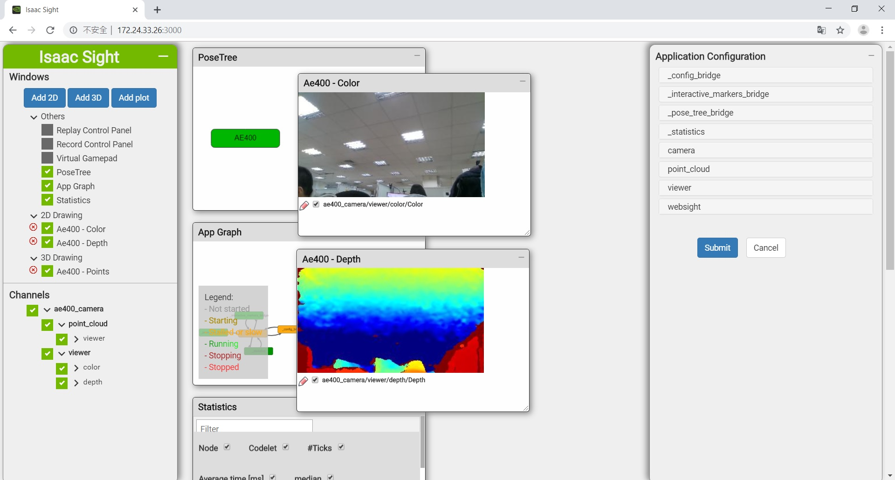

# LIPSedge™ AE400 Industrial 3D Camera

**LIPSedge™ AE400** is an industrial GigE 3D camera with IP67 protection and powered by Intel® RealSense™ technology and designed for industrial applications, such as robot application, logistic/factory automation, and 3D monitoring/inspection.

 - [Product Overview](https://www.lips-hci.com/product-page/lipsedge-ae400-industrial-3d-camera)
 - [Product Datasheet](https://filebox.lips-hci.com/index.php/s/ZNO5JggmYeddYcA?path=%2FDatasheet#pdfviewer)
 - [Developer Support](https://github.com/lips-hci)
 - Product Videos
   * AE400 360° Product View and Introduction  [](https://www.youtube.com/watch?v=kyjbJSM6CjQ "LIPSedge™ AE400 Industrial 3D Camera")
   * AE400 Point Cloud [](http://www.youtube.com/watch?v=oSCOOGzJRbo "LIPSedge™ AE400 Point Cloud")

## PREREQUISITE

1. Prepare a Ubuntu 18.04 x64 desktop equipped with a NVIDIA video card that supports CUDA.
 - download Isaac SDK to any directory you preferred, e.g. the folder ~/Downloads in your home directory.

2. Download latest NVIDIA Isaac SDK from website:
 - https://developer.nvidia.com/isaac/downloads

3. Install dependencies of desktop/Bazel/NVIDIA GPU Driver according to the following document:
 - https://docs.nvidia.com/isaac/isaac/doc/setup.html#prerequisites

  - Important! Remember to install Ubuntu dependencies by running this script (in SDK).
  ```
  ~/Downloads/isaac$ engine/build/scripts/install_dependencies.sh
  ```

4. git clone LIPS stereo_ae400 workspace:
 ```
 $ cd ~/Downloads
 $ git clone https://github.com/lips-hci/stereo_ae400.git
 ```

### Branch/tag information

:bulb: The branch '_master_' now supports the latest Isaac SDK [2020.1](https://developer.nvidia.com/isaac-sdk-20200514-b2b122e2e) with new features.
 - support left/right IR cameras
 - more config options to control streams (Depth/RGB/IR)

With latest version, you can select left and right IR channels to view in Isaac Sight webpage.


#### support for previous releases

1. Switch to tag '_isaac-2019.3_' if you are using previous Isaac SDK [2019.3](https://developer.nvidia.com/isaac-sdk-20193).

2. Switch to tag '_isaac-2019.2_' for users who want to stay at Isaac release [2019.2](https://developer.nvidia.com/isaac/download/releases/2019.2/isaac-sdk-2019-2-30e21124-tar-xz).

### AE400 Firmware requirements

1. :bulb: The branch '_master_' now runs AE400 RealSense SDK **v0.9.0.7** at host-side, device firmware minimum requirement is **1.4**. Please [contact us](https://www.lips-hci.com/contact) to get firmware upgrade support.

2. If your device is still firmware 1.1, you should use tag '_sdk-v0.9.0.5_' for development.

3. :point_right: [How to check my AE400 firmware version?](doc/check_ae400_firmware_version.md)

### Learn more

1. How to switch between Intel and NVIDIA video cards on Ubuntu?

 - https://www.linuxbabe.com/desktop-linux/switch-intel-nvidia-graphics-card-ubuntu

2. If you want to install CUDA 10.0 manually, you can refer this one-click-install script.

 - https://gist.github.com/bogdan-kulynych/f64eb148eeef9696c70d485a76e42c3a

## Build software app for AE400 camera on Isaac SDK

1. create a folder named 'issac' under ~/Downloads and untar the Isaac SDK into it
```
 $ mkdir -p ~/Downloads/isaac
 $ cd ~/Downloads
 $ tar Jxvpf isaac-sdk-2019.2-30e21124.tar.xz -C isaac
```

2. modify the path in the WORKSPACE under the stereo_ae400 folder.
```
 local_repository(
     name = "com_nvidia_isaac",
     path = "/home/jsm/Downloads/isaac", # Here to sepcify your Issac SDK location, e.g. ~/Downloads/issac
 )
```

3. build the app under stereo_ae400 folder.
```
 $ cd ~/Downloads/stereo_ae400
 $ bazel build //app/ae400_camera
```
 note: make sure your host can access to Internet, or you will get build errors

4. IP address configuration

#### Camera side:

 The default setting of AE400 camear is _192.168.0.100_, however, you can assign new IP address to it via browser.

 Input URL http://192.168.0.100 to open AE400 configuration page, log in, write new IP address and save setting

 

 note: Check your product manual to find login account and password, or contact [LIPS](https://www.lips-hci.com/contact) to get support

#### Host side:

 Configure the IP address for connecting AE400 by editing the network setting file
```
 $ vi config/network.json

 {
   "config": {
     "ip": "192.168.0.100"  <= it should match AE400 camera's IP address
   }
 }
```

 Then install the setting to your system
```
 $ sudo mkdir -p /usr/etc/LIPS/lib
 $ sudo cp config/network.json /usr/etc/LIPS/lib/
```

 note: AE400 software looks for setting in system path ``/usr/etc/LIPS/lib/network.json``. If file is missing, default IP address _192.168.0.100_ is applied.

5. run camera app by command-line.
```
 $ bazel run //app/ae400_camera
```

 note: make sure the host, AE400 camera, and the remote robot are at same network domain, so they can connect to each other.

6. Open a web brower, connect to http://localhost:3000

 From left panel, select ae400_camera checkbox to enable depth/color channels for streaming.

 Here is a screenshot of Isaac Sight webpage.
 

7. Enjoy!

## Deploy the app to remote robot (optional)
You can run the app on remote robot like Jetson Nano or TX2

#### Deploy the app to remote robot
 - Use below command on your host side.
```
 # deploy.sh --remote_user <username_on_robot>
              -p //app/ae400_camera:ae400_camera-pkg
              -d <jetpack42 | jetpack43>
              -h <robot_ip>
              -u <insatll_home_name_you_want>
```

 - For example:
```
 $ ./deploy.sh --remote_user lips -p //app/ae400_camera:ae400_camera-pkg -d jetpack42 -h 192.168.0.100 -u dt
```

#### Run the app remotely on robot

 - Use below commands on your host side:

 1. make sure you have an SSH key on your desktop machine.
```
 $ ssh-keygen
 $ ssh-copy-id <username_on_robot>@<robot_ip>
```
 note: use command ssh-copy-id to save your time typing password when loging in to robot by ssh.

 2. copy network.json to remote robot
```
 $ scp config/network.json <username_on_robot>@<robot_ip>:~/
```

 3. ssh log in to remote robot

 - install network setting
```
 $ ssh <username_on_robot>@<robot_ip>
 $ sudo mkdir -p /usr/etc/LIPS/lib
 $ vi ~/network.json   //optional, if you want to re-assign IP address for connection
 $ sudo cp ~/network.json /usr/etc/LIPS/lib/
```

 - run the app
```
 $ cd ~/deploy/<install_home_name_you_want>/ae400_camera-pkg
 $ ./app/ae400_camera/ae400_camera
```

 4. open a web brower, connect to http://*<robot_ip>:3000*

 5. from left panel, select ae400_camera checkbox to enable depth/color channels for streaming.
