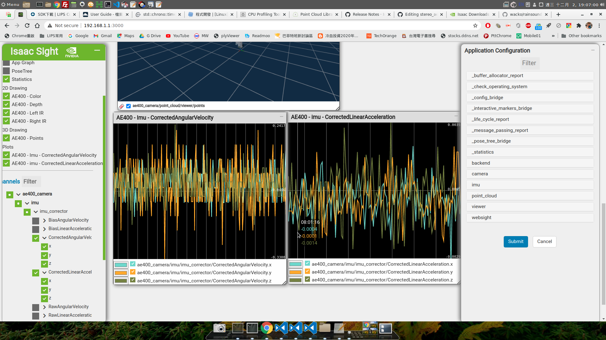
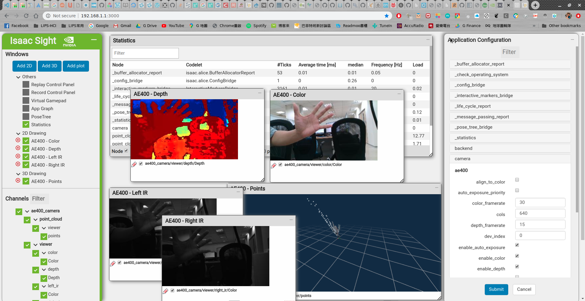
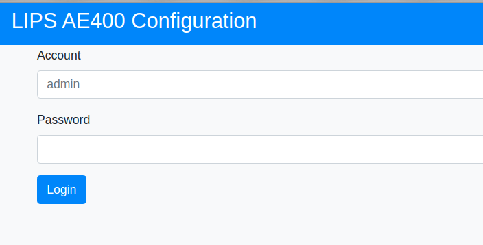

# LIPSedge™ AE400 Industrial 3D Camera

**LIPSedge™ AE400** is an industrial GigE 3D camera with IP67 protection and powered by Intel® RealSense™ technology and designed for industrial applications, such as robot application, logistic/factory automation, and 3D monitoring/inspection.

 - [Product Overview](https://www.lips-hci.com/product-page/lipsedge-ae400-industrial-3d-camera)
 - [Product Datasheet](https://filebox.lips-hci.com/index.php/s/ZNO5JggmYeddYcA?path=%2FDatasheet#pdfviewer)
 - [Latest LIPS SDK & FW Upgrade](https://www.lips-hci.com/lipssdk)

 | Title | Video |
 | ----- | --- |
 | AE400 360° Product View and Introduction | [](https://www.youtube.com/watch?v=kyjbJSM6CjQ "LIPSedge™ AE400 Industrial 3D Camera") |
 | AE400 Point Cloud DEMO (use realsense-viewer) | [](http://www.youtube.com/watch?v=oSCOOGzJRbo "LIPSedge™ AE400 Point Cloud") |

## PREREQUISITE

1. Prepare a Ubuntu 18.04 x64 desktop equipped with a NVIDIA video card that supports CUDA.
 - download Isaac SDK to any directory you preferred, e.g. your home directory ~/

2. Download latest NVIDIA Isaac SDK from website:
 - https://developer.nvidia.com/isaac/downloads

3. Install dependencies of desktop/Bazel/NVIDIA GPU Driver according to the following document:
 - https://docs.nvidia.com/isaac/isaac/doc/setup.html#prerequisites

  - Important! Remember to install Ubuntu dependencies by running this script (in SDK).
  ```
  ~/isaac$ engine/build/scripts/install_dependencies.sh
  ```

## Quick Start

1. Download latest NVIDIA Isaac SDK
- https://developer.nvidia.com/isaac/downloads

2. Git clone LIPS stereo_ae400 workspace:
```
$ cd ~/
$ git clone https://github.com/lips-hci/stereo_ae400.git
```

3. Specify path of Isaac SDK in the WORKSPACE file under folder stereo_ae400.
```
local_repository(
     name = "com_nvidia_isaac",
     path = "/home/nvidia/isaac", # Here to sepcify your Isaac SDK location, change nvidia by your username
 )
```

4. Build application under folder stereo_ae400.
```
$ cd ~/stereo_ae400
$ bazel build //apps/ae400_camera
```

5. Run app
```
$ bazel run //apps/ae400_camera
```


### AE400 Firmware requirements

1. The branch '_master_' now runs AE400 RealSense SDK **v1.0.0.2** at host-side, device firmware minimum requirement is **V2.1**.
 - [Release Note](https://filebox.lips-hci.com/index.php/s/twUlwqdzNFl7RAc?path=%2FRelease%20Note)
 - [User Guide](https://filebox.lips-hci.com/index.php/s/twUlwqdzNFl7RAc?path=%2FUser%20Guide)
   (Please refer section 'Updating Firmware')

2. :point_right: [How to check my AE400 firmware version?](doc/check_ae400_firmware_version.md)

3. The pervious firmware **v1.4** works for AE400 SDK '_v0.9.0.7_' on ISAAC SDK 2019.x~2020.1

3. If your device is still firmware 1.1, use tag '_sdk-v0.9.0.5_' for development.


### Branch/tag information

:bulb: The branch '_master_' now supports latest ISAAC SDK [2020.2](https://developer.nvidia.com/isaac/downloads) with new features.
 - reading depth/color camera intrinisics
 - reading IMU 6-axis sensor data
 - new app multicam wich can demo both depth and color streaming from 2 (or more) AE400 cameras


AE400 new features for Isaac 2020.1
 - support left/right IR cameras
 - more config options to control streams (Depth/RGB/IR)

From this version, you can select left and right IR channels to view in Isaac Sight webpage.



previous releases support

 - Switch to tag '_isaac-2019.3_' if you are using previous Isaac SDK [2019.3](https://developer.nvidia.com/isaac-sdk-20193).

 - Switch to tag '_isaac-2019.2_' for users who want to stay at Isaac release [2019.2](https://developer.nvidia.com/isaac/download/releases/2019.2/isaac-sdk-2019-2-30e21124-tar-xz).


### Learn more

1. How to switch between Intel and NVIDIA video cards on Ubuntu?

 - https://www.linuxbabe.com/desktop-linux/switch-intel-nvidia-graphics-card-ubuntu

2. If you want to install CUDA 10.0 manually, you can refer this one-click-install script.

 - https://gist.github.com/bogdan-kulynych/f64eb148eeef9696c70d485a76e42c3a


## Network configurations

1. IP address setting - Camera side:

 The default setting of AE400 camera is _192.168.0.100_, however, you can assign new IP address to it via browser.

 Input IP as URL http://192.168.0.100 to open AE400 configuration page, log in, write new IP address and save setting

 

 note: Check your product manual to find login account and password, or contact [LIPS](https://www.lips-hci.com/contact) to get support

2. IP address setting - Host side:

 Configure the IP address for connecting AE400 by editing the network setting file
```
 $ vi config/network.json

 {
   "config": {
     "ip": "192.168.0.100"  <= it should match AE400 camera's IP address
   }
 }
```

3. Install network setting into your system
```
 $ sudo mkdir -p /usr/etc/LIPS/lib
 $ sudo cp config/network.json /usr/etc/LIPS/lib/
```

note: AE400 software looks for setting in system path ``/usr/etc/LIPS/lib/network.json``. If file is missing, default IP address _192.168.0.100_ is applied.


## Run camera sample application

1. Launch app by bazel commandline
```
 $ bazel run //apps/ae400_camera
```

 note: make sure the host, AE400 camera, and the remote robot are at same network domain, so they can connect to each other.

2. Open a web brower, connect to http://localhost:3000

 From left panel, select ae400_camera checkbox to enable depth/color channels for streaming.

 Here is a screenshot of Isaac Sight webpage.
 


### Deploy the sample application to remote robot (optional)
You can run the application on remote robot like Jetson Nano or TX2

#### Deploy the sample application to remote robot
 - To run ae400_camera sample application on the robot first deploy the package with Isaac SDK built-in command.
```
 # deploy.sh --remote_user <username_on_robot>
              -p //apps/ae400_camera:ae400_camera-pkg
              -d <jetpack44>
              -h <robot_ip>
              --run [optional]
```

 Where <username_on_robot> is your user name on the robot, and <robot_ip> is the IP address of the robot.

 Using the --run (or -r) option causes deploy.sh to automatically run the application on the robot after deployment.

 - For example, assume <robot_ip> is 192.168.0.99, the command is
```
 $ cd ~/stereo_ae400
 ~/stereo_ae400$ ln -s ~/isaac/engine/build/deploy.sh .
 ~/stereo_ae400$ ./deploy.sh --remote_user lips -p //apps/ae400_camera:ae400_camera-pkg -d jetpack44 -h 192.168.0.99
```

#### Run the sample application remotely on robot

 - Use below commands on your host side:

 1. make sure you have an SSH key on your desktop machine.
```
 $ ssh-keygen
 $ ssh-copy-id <username_on_robot>@<robot_ip>
```
 note: use command ssh-copy-id to save your time typing password when loging in to robot by ssh.

 2. install network setting to remote robot
```
 $ cd ~/isaac
 $ vi config/network.json   //optional, re-assign IP address if you want
 $ ssh <username_on_robot>@<robot_ip> "sudo mkdir -p /usr/etc/LIPS/lib"
 $ scp config/network.json <username_on_robot>@<robot_ip>:/usr/etc/LIPS/lib/
```

 3. Login to the robot to run the application
```
 $ ssh <username_on_robot>@<robot_ip>
 $ cd ~/deploy/<username_on_host>/ae400_camera-pkg
 $ ./apps/ae400_camera/ae400_camera
```

 4. open a web brower, connect to http://*<robot_ip>:3000*

 5. from left panel, select ae400_camera checkbox to enable depth/color channels for streaming.
