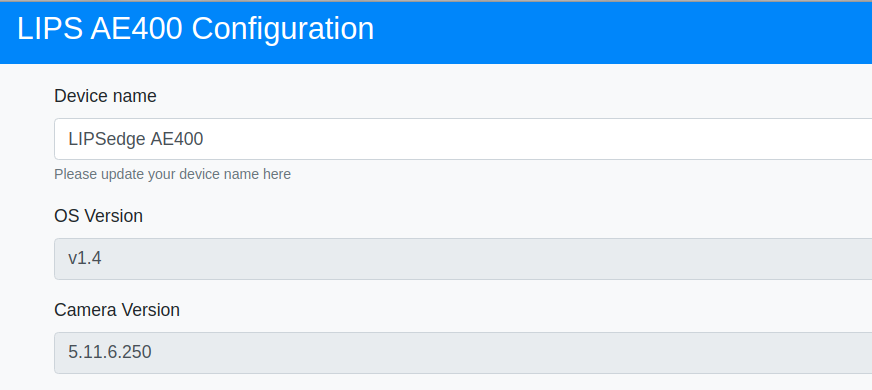

## How to check my AE400 firmware version?

1. Input URL http://192.168.0.100 (or your defined AE400 IP address) to open online configuration page and log in.

 

 - You can find login account and password in AE400 product manual.
 
  - If you cannot find it, please contact [LIPS](https://www.lips-hci.com/contact) to get support.

2. The field '**OS Version**' is your AE400 firmware version.

